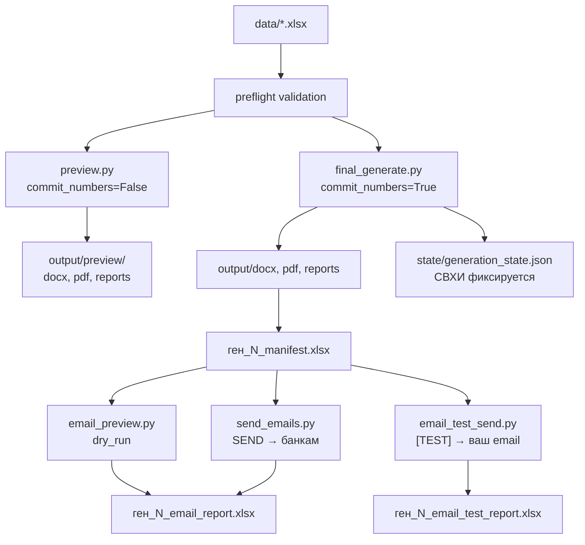

# AGENTS.md — полный контекст проекта WordRedactor (RenSer)

> **Для AI-агентов:** прочитай этот файл **первым**, до обхода кодовой базы.
> Здесь вся архитектура, границы изменений, команды и текущий контекст пользователя.
> Не трать токены на повторное исследование того, что уже описано ниже.

---

## 1. Что это за проект

**WordRedactor** (папка `ШИфр`, бренд RenSer) — Windows-бот на Python для:

1. Чтения банков из Excel
2. Генерации персонализированных Word-писем (DOCX) по шаблонам
3. Конвертации DOCX → PDF через **Microsoft Word COM**
4. Фиксации исходящих номеров (СВХИ)
5. **Отдельной** email-рассылки PDF по SMTP (Plesk / Hoster.kz)

**Официальный документ — PDF.** DOCX — промежуточный файл.

**Email не запускается автоматически** после генерации PDF.

---

## 2. Критические правила для агентов

### НЕ ЛОМАТЬ без явного запроса пользователя

| Подсистема | Ключевые файлы |
|---|---|
| Генерация DOCX/PDF | `src/main.py`, `src/document_generator.py`, `src/word_process.py`, `src/pdf_converter.py`, `preview.py`, `final_generate.py` |
| Preview / Final режимы | `src/main.py`, `src/output_utils.py` |
| СВХИ / state | `src/state_manager.py`, `state/generation_state.json` |
| Manifest PDF | `src/manifest_report.py` |
| Error report | `src/error_report.py` |
| Status report | `src/status_report.py`, `src/preflight.py` |
| Word-шаблоны | `templates/Template_word*.docx` |

### Email — можно менять только эти файлы

- `src/email_sender.py`
- `src/email_pipeline.py`
- `src/email_report.py`
- `email_preview.py`
- `email_test_send.py`
- `send_emails.py`
- `.env.example` (без реальных паролей)
- `templates/email_template.txt` — текст письма
- `config.yaml` → секция `email:` — тема письма

### Секреты

- Реальные пароли только в `.env` (в `.gitignore`)
- **Никогда** не коммитить `.env`
- `.env.example` — шаблон без пароля

### Конфигурация

- Проект читает **реальный `.env`** через `load_dotenv(project_root / ".env")` в `src/config.py`
- Excel-файл задаётся в `config.yaml` → `paths.excel_file` (не хардкодить путь в коде)

---

## 3. Архитектура (потоки данных)



**Email читает manifest, не Excel напрямую.**

---

## 4. Структура файлов (карта ответственности)

### Точки входа (корень проекта)

| Файл | Назначение |
|---|---|
| `preview.py` | Тестовая генерация, СВХИ **не тратятся** |
| `final_generate.py` | Финальная генерация, СВХИ **фиксируются** после успешного PDF |
| `confirm_counter.py` | Просмотр/ручная правка счётчика СВХИ |
| `email_preview.py` | Просмотр рассылки по **final** manifest, `dry_run`, без SMTP |
| `email_test_send.py` | Тест по **final** manifest; спрашивает email; `--all` — все письма |
| `preview_one_mail.py` | **Fast test** после `preview.py` → 1 письмо на `TEST_MAIL` из `.env` |
| `send_emails.py` | Реальная рассылка банкам, подтверждение `SEND` |
| `run.py` | CLI с флагами `--preview` / `--commit-numbers` |

### `src/` — ядро

| Модуль | Роль |
|---|---|
| `main.py` | Оркестратор генерации (preview + final) |
| `config.py` | `Settings` из `config.yaml` + `.env` |
| `excel_reader.py` | Чтение Excel → `BankRow` |
| `preflight.py` | Валидация всех строк до генерации |
| `document_generator.py` | Сборка DOCX |
| `word_process.py` | Замена плейсхолдеров в Word |
| `pdf_converter.py` | DOCX→PDF через Word COM |
| `template_selector.py` | Выбор long/short/default шаблона по длине обращения |
| `state_manager.py` | `generation_state.json` |
| `manifest_report.py` | `ген_N_manifest.xlsx` |
| `status_report.py` | `status_YYYYMMDD_HHMMSS.xlsx` |
| `error_report.py` | `ген_N_ошибки.txt` |
| `email_pipeline.py` | Логика preview/test/send email |
| `email_sender.py` | SMTP (SSL/STARTTLS) |
| `email_report.py` | Excel-отчёты рассылки |
| `validators.py` | `is_valid_email`, валидация строк |
| `name_utils.py` | `build_greeting_name` (минимум 2 слова) |
| `models.py` | `BankRow`, статусы строк |

### Данные и шаблоны

| Путь | Содержимое |
|---|---|
| `config.yaml` | Пути, задержка email, тема письма |
| `.env` | SMTP, FROM_*, START_OUT_NUMBER (секреты) |
| `data/banks_uzbekistan_letter_bot_filled.xlsx` | **Текущий** рабочий Excel (Узбекистан) |
| `data/ТуркменистанФейкПочта.xlsx` | Тестовый Excel с фейковой почтой пользователя (Туркменистан) |
| `templates/Template_word.docx` | Основной Word-шаблон |
| `templates/Template_word_greeting_long.docx` | Обращение > 20 символов |
| `templates/Template_word_greeting_short.docx` | Обращение < 10 символов |
| `templates/email_template.txt` | Тело email |

### Выходные папки (в `.gitignore`, кроме `.gitkeep`)

```
output/docx/          — финальные DOCX
output/pdf/           — финальные PDF
output/reports/       — финальные отчёты, manifest, email reports
output/preview/docx/
output/preview/pdf/
output/preview/reports/
state/generation_state.json
logs/app.log
```

---

## 5. Конфигурация

### `config.yaml` (текущее состояние)

```yaml
paths:
  excel_file: "data/banks_uzbekistan_letter_bot_filled.xlsx"  # сменить для теста ТМ
  email_template: "templates/email_template.txt"
  word_template: "templates/Template_word.docx"

app:
  delay_between_emails_seconds: 15   # send_emails.py и email_test_send.py --all

email:
  subject_template: "Предложение по поставке банковских карт и PIN-конвертов для {{EMAIL_BANK_NAME}}"
```

### `.env` (шаблон в `.env.example`)

```env
SMTP_HOST=renser.kz          # НЕ email! Сервер Plesk/Hoster.kz
SMTP_PORT=465                # 465 = SMTP_SSL, 587 = STARTTLS
SMTP_USER=manager4@renser.kz
SMTP_PASSWORD=               # только в реальном .env
FROM_EMAIL=manager4@renser.kz
FROM_NAME=RenSer Technologies
START_OUT_NUMBER=315         # только при первом создании state/
```

### SMTP-логика (`src/email_sender.py`)

| Порт | Режим | Реализация |
|---|---|---|
| 465 | `SMTP_SSL` | `smtplib.SMTP_SSL`, **без** `starttls()` |
| 587 | `STARTTLS` | `SMTP` + `starttls()` |
| другое | `PLAIN_SMTP` | обычный `SMTP` |

Если `SMTP_HOST` содержит `@` → ошибка «похож на email».

---

## 6. СВХИ (исходящие номера)

Файл: `state/generation_state.json`

```json
{
  "last_committed_out_number": 314,
  "last_generation_id": 7
}
```

| Правило | Детали |
|---|---|
| `START_OUT_NUMBER` в `.env` | Только при **первом** создании state |
| Preview | Номера показываются, но **не фиксируются** |
| Final | Номер фиксируется **только после успешного PDF** |
| DOCX без PDF | Номер **не тратится** |
| PDF без email | Номер **уже потрачен**, откат невозможен |
| Preflight-ошибка | Номер **не тратится** |

Подтверждение final: ввести ровно `YES`.
Подтверждение рассылки: ввести ровно `SEND`.

---

## 7. Excel — колонки

| Колонка | Назначение |
|---|---|
| `bank_name` | Краткое имя |
| `bank_legal_name` | Юр. название в Word/PDF |
| `recipient_email` | Получатель (для manifest и send_emails) |
| `cc_email`, `bcc_email` | Копии |
| `chair_full_name` | Полное ФИО председателя |
| `chair_short_dative` | Дательный падеж кратко |
| `gender` | `male` / `female` |
| `greeting_name` | Обращение, **минимум 2 слова** |
| `pdf_filename` | Имя PDF-файла |
| `email_bank_name` | Название банка в теме/теле email (`{{EMAIL_BANK_NAME}}`) |

### Тестовый Excel Туркменистан

Файл: `data/ТуркменистанФейкПочта.xlsx` — для тестов с почтой пользователя вместо банков.

Чтобы переключиться:
```yaml
# config.yaml
paths:
  excel_file: "data/ТуркменистанФейкПочта.xlsx"
```
Затем: `preview.py` → `final_generate.py` → email-скрипты.
Пользователь сам скажет, когда вернуть настоящий Excel.

---

## 8. Word-шаблоны — плейсхолдеры

| Плейсхолдер | Источник |
|---|---|
| `{{OUT_NUMBER}}` | СВХИ |
| `{{DATE}}` | Дата генерации (синоним `{{TODAY}}`) |
| `{{TODAY}}` | Актуальная дата генерации, формат `config.yaml` → `date_format` |
| `{{BANK_LEGAL_NAME}}` | Excel |
| `{{MR_MS}}` | г-же / г-ну по gender |
| `{{CHAIR_SHORT_DATIVE}}` | Excel |
| `{{GREETING_WORD}}` | Уважаемый / Уважаемая |
| `{{GREETING_NAME}}` | `build_greeting_name()` |

Выбор шаблона по длине `greeting_name_final`:
- \> 20 символов → `Template_word_greeting_long.docx`
- \< 10 символов → `Template_word_greeting_short.docx`
- иначе → `Template_word.docx`

---

## 9. Email — полная спецификация

### Скрипты

| Команда | SMTP_PASSWORD | Куда шлёт | Отчёт |
|---|---|---|---|
| `python email_preview.py` | **не нужен** | никуда | `ген_N_email_report.xlsx` (`dry_run`) |
| `python email_test_send.py` | нужен | 1 письмо → ваш email | `ген_N_email_test_report.xlsx` |
| `python email_test_send.py --all` | нужен | все N писем → ваш email | `ген_N_email_test_report.xlsx` |
| `python send_emails.py` | нужен | банкам из manifest | `ген_N_email_report.xlsx` |

### Manifest

- Берётся **последний** `output/reports/ген_*_manifest.xlsx`
- Preview manifest (`output/preview/reports/`) — **запрещён** для email
- Override: `--manifest path/to/ген_N_manifest.xlsx`

### Тема и текст письма — где редактировать

| Что | Файл |
|---|---|
| **Тема** | `config.yaml` → `email.subject_template` |
| **Текст** (основной блок) | `templates/email_template.txt` |
| **Подпись plain** | `templates/email_signature.txt` |
| **Подпись HTML** | `templates/email_signature.html` |

Письмо уходит в двух версиях: `text/plain` (fallback) + `text/html` (с синей подписью и ссылкой).

### Переменные email (формат `{{ИМЯ}}`)

| Переменная | Откуда | Типичное использование |
|---|---|---|
| `{{BANK_NAME}}` | `bank_name` | Краткое имя банка |
| `{{EMAIL_BANK_NAME}}` | `email_bank_name` | Название банка для email (тема/текст) |
| `{{BANK_LEGAL_NAME}}` | Excel | текст письма |
| `{{OUT_NUMBER}}` | manifest | номер |
| `{{DATE}}` | manifest | дата |
| `{{GREETING_WORD}}` | manifest | Уважаемый/ая |
| `{{GREETING_NAME}}` | manifest | имя в обращении |
| `{{CHAIR_FULL_NAME}}` | manifest | ФИО |

Подстановка: `EmailSender.render_template()` в `src/email_sender.py`.
Данные собираются в `build_email_variables()` в `src/email_pipeline.py`.

### Тестовая отправка

- Префикс темы: `[TEST]`
- В теле сверху:
  ```
  ТЕСТОВАЯ ОТПРАВКА.
  Оригинальный получатель: original@example.com
  ```
- CC/BCC в тесте **не используются** (пустые)
- Задержка между письмами в `--all`: `delay_between_emails_seconds` (15 сек)

### Resume реальной рассылки

Ключ: `generation_id + out_number + recipient_email + pdf_path`

| Статус | Поведение при повторном `send_emails.py` |
|---|---|
| `sent` | **пропускается** |
| `dry_run`, `failed`, `pending` | **отправляется снова** |
| `test_sent`, `test_failed` | в другом файле, **не влияет** |

`send_emails.py` **не читает** `ген_N_email_test_report.xlsx`.

`--resend-all` — игнорировать resume, отправить всё заново.

### Статусы `ген_N_email_report.xlsx`

`pending`, `dry_run`, `sent`, `failed`, `skipped_pdf_missing`, `skipped_invalid_email`

### Статусы `ген_N_email_test_report.xlsx`

`test_sent`, `test_failed`

Колонки тестового отчёта включают `original_recipient_email` и `test_recipient_email`.

### Валидация SMTP (перед send/test)

Проверяется: `SMTP_HOST`, `SMTP_PORT`, `SMTP_USER`, `SMTP_PASSWORD`, `FROM_EMAIL`.
`SMTP_HOST` не должен содержать `@`.
`FROM_EMAIL` должен быть валидным email.
`SMTP_USER ≠ FROM_EMAIL` → warning, не ошибка.

---

## 10. Отчёты и именование файлов

| Файл | Когда создаётся |
|---|---|
| `ген_N_manifest.xlsx` | После генерации (успешные PDF) |
| `ген_N_ошибки.txt` | Если были ошибки |
| `status_YYYYMMDD_HHMMSS.xlsx` | После каждого запуска генерации |
| `ген_N_email_report.xlsx` | email_preview / send_emails |
| `ген_N_email_test_report.xlsx` | email_test_send |

`N` = `last_generation_id` из state.

Preview-отчёты: `output/preview/reports/ген_N_*`

---

## 11. Команды (шпаргалка)

```bash
# Установка
pip install -r requirements.txt
# .env уже создан пользователем, не коммитить

# Генерация
python preview.py                    # тест, СВХИ не тратятся
python final_generate.py             # финал, подтверждение YES
python confirm_counter.py            # проверить/править счётчик

# Email (после final)
python email_preview.py              # dry_run, без пароля
python email_test_send.py            # 1 тестовое письмо
python email_test_send.py --all      # все письма на ваш email (~7 мин на 28 шт)
python send_emails.py                # реальная рассылка, ввод SEND

# С конкретным manifest
python send_emails.py --manifest output/reports/ген_7_manifest.xlsx
python send_emails.py --resend-all
```

---

## 12. Типичные задачи → что менять

| Задача пользователя | Файлы |
|---|---|
| Сменить Excel | `config.yaml` → `paths.excel_file` |
| Тема письма | `config.yaml` → `email.subject_template` |
| Текст письма | `templates/email_template.txt` |
| Текст в Word/PDF | `templates/Template_word*.docx` |
| SMTP настройки | `.env` |
| Задержка между письмами | `config.yaml` → `delay_between_emails_seconds` |
| Починить SMTP SSL | `src/email_sender.py` |
| Логика рассылки/resume | `src/email_pipeline.py` |
| Исправить СВХИ вручную | `confirm_counter.py` или `state/generation_state.json` |

---

## 13. Окружение и ограничения

- **OS:** Windows 10/11 (Word COM для PDF)
- **Python:** 3.10+
- **Зависимости:** `requirements.txt` (python-docx, openpyxl, pydantic, PyYAML, pywin32)
- PowerShell: `&&` не работает → `Set-Location path; python script.py`
- Путь проекта содержит кириллицу: `c:\Users\user\Desktop\ШИфр`

---

## 14. Частые ошибки

| Симптом | Причина | Решение |
|---|---|---|
| Номера тратятся при тесте | Запущен `final_generate.py` | Использовать `preview.py` |
| Email шлёт не туда | Не тот manifest / не тот Excel | Проверить `config.yaml`, последний `ген_N_manifest.xlsx` |
| Resume пропускает банк | Статус `sent` в email_report | Норма; `--resend-all` для повтора |
| Тест сломал resume | Старый баг (исправлен) | Тест пишет только `email_test_report` |
| SMTP auth fail | Неверный пароль / порт | 465=SSL, проверить `.env` |
| `SMTP_HOST похож на email` | В host указан email | Указать `renser.kz` |
| Одно слово после «Уважаемый» | Плохой `greeting_name` | Исправить Excel |
| ModuleNotFoundError yaml | Не установлены deps | `python -m pip install -r requirements.txt` |

---

## 15. История изменений (контекст для агента)

Уже реализовано (не переделывать без запроса):

- SMTP_SSL на порту 465 (Plesk/Hoster.kz)
- Отдельный `email_test_report` (не влияет на resume)
- `email_preview.py` без SMTP_PASSWORD
- `email_test_send.py --all` — все письма на тестовый email
- Resume только по `sent` в `email_report`
- Задержка 15 сек между письмами (намеренно, не уменьшать без запроса)

Планируется пользователем:
- Тест с `data/ТуркменистанФейкПочта.xlsx`, потом смена на настоящий Excel

Глобальные правила Cursor (все проекты):
- `~/.cursor/rules/logging-and-documentation.mdc` — умное логирование + обновление docs при каждом изменении
- Локально: `.cursor/rules/logging-and-documentation.mdc` — дополнение для WordRedactor

- `{{BANK_NAME}}` → колонка `bank_name`; `{{EMAIL_BANK_NAME}}` → колонка `email_bank_name` (раздельно с 2026-06)
- `{{TODAY}}` / `{{DATE}}` в Word — дата дня генерации, не из Excel
- Email: multipart plain+HTML; подпись в `templates/email_signature.txt` / `.html`

---

## 16. Чеклист перед изменениями

1. Понять, какой этап: генерация PDF или email?
2. Если email — трогать только файлы из §2
3. Не коммитить `.env`, не добавлять пароли в `.env.example`
4. Не менять логику СВХИ при правках email
5. После email-правок проверить: `python email_preview.py` (без пароля)
6. Не создавать коммит без явного запроса пользователя
